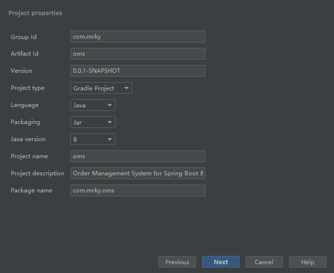
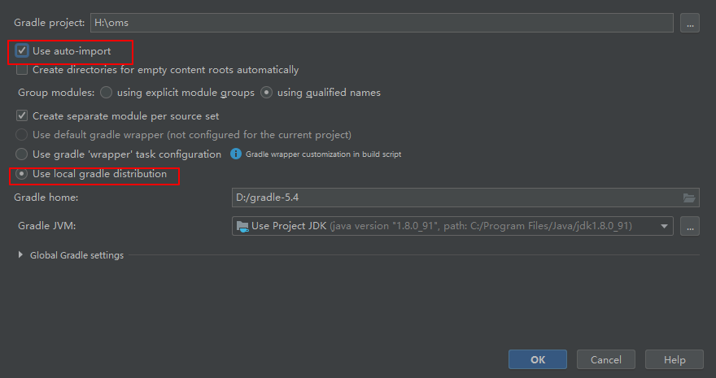
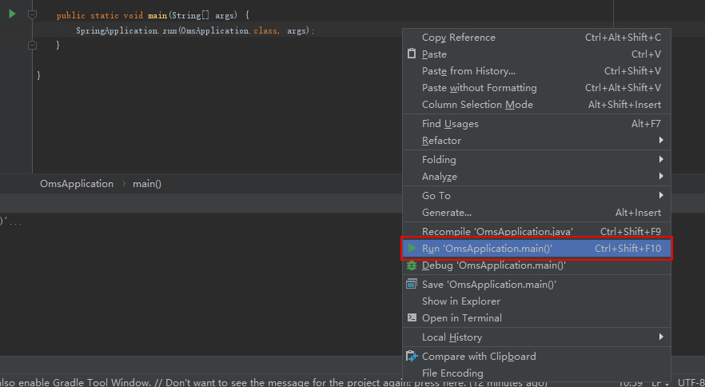
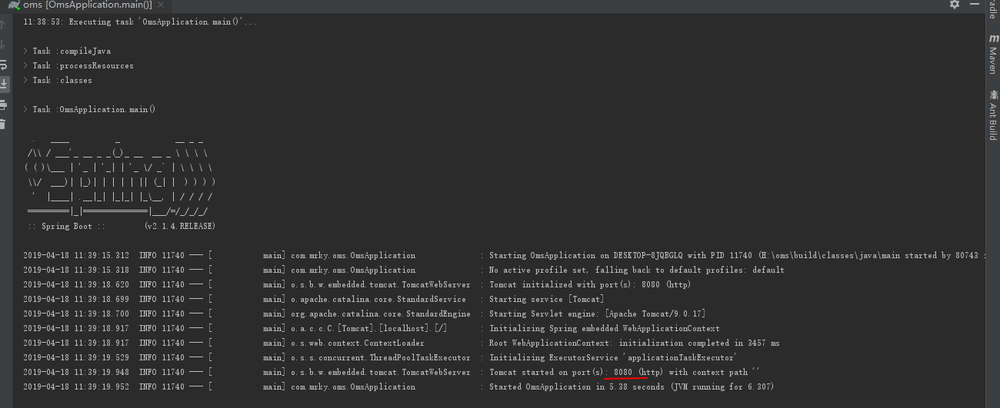
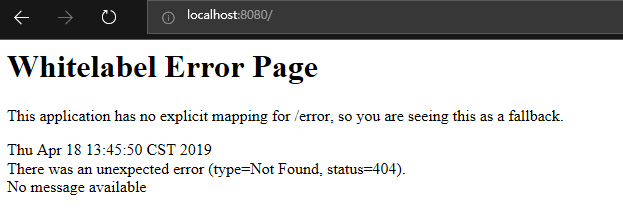

# oms

[演示地址](http://njcky.gitee.io/oms/)
> readme 太丑, 以后有空再整理

- [oms](#oms)
  * [介绍](#介绍)
  * [软件架构](#软件架构)
  * [环境配置](#环境配置)
  * [前后端分离](#前后端分离)
  * [参与贡献](#参与贡献)

<small><i><a href='http://ecotrust-canada.github.io/markdown-toc/'>Table of contents generated with markdown-toc</a></i></small>


## s1
Order management system
build with spring & mysql

## s2
前端：React + AntDesign
后端：Spring Boot
数据库： MySQL


## 环境配置
1. 若使用IDEAC, 安装 Spring Assistant 插件; 或者使用官方提供的 [Spring Initializer](https://start.spring.io)
    
    gradle 修改为国内镜像：
    C:\Users\<windows用户名称>\.gradle 中新建文件init.gradle
    文件内容如下:
  ```java
  
  allprojects{
      repositories {
          def ALIYUN_REPOSITORY_URL = 'http://maven.aliyun.com/nexus/content/groups/public'
          def ALIYUN_JCENTER_URL = 'http://maven.aliyun.com/nexus/content/repositories/jcenter'
          all { ArtifactRepository repo ->
              if(repo instanceof MavenArtifactRepository){
                  def url = repo.url.toString()
                  if (url.startsWith('https://repo1.maven.org/maven2')) {
                      project.logger.lifecycle "Repository ${repo.url} replaced by $ALIYUN_REPOSITORY_URL."
                      remove repo
                  }
                  if (url.startsWith('https://jcenter.bintray.com/')) {
                      project.logger.lifecycle "Repository ${repo.url} replaced by $ALIYUN_JCENTER_URL."
                      remove repo
                  }
              }
          }
          maven {
              url ALIYUN_REPOSITORY_URL
              url ALIYUN_JCENTER_URL
          }
      }
  }
  ```


2. IDE 中新建工程

   

3. 添加依赖

   

4. 设置gradle自动导入包

   

5. 等待配置包完成后，主文件自动变为可执行

   

6. 启动服务

   

本机Gradle已经内置了Wrapper Task，执行Wrapper Task就可以在项目目录中生成Gradle Wrapper的目录文件。在项目根目录执行gradle wrapper就可以了，会生成和本机gradle相同的版本信息

> gradlew = gradle + wrapper

```
$ gradle wrapper

> Task :wrapper
> BUILD SUCCESSFUL **in** 0s
> 1 actionable task: 1 executed
```

这时会在项目根目录中生成如下文件：

```
├── gradle
│   └── wrapper
│       ├── gradle-wrapper.jar
│       └── gradle-wrapper.properties
├── gradlew
└── gradlew.bat
```

每个文件的含义如下：

- gradle-wrapper.jar ：包含Gradle运行时的逻辑代码。
- gradle-wrapper.properties ：负责配置包装器运行时行为的属性文件，用来配置使用哪个版本的Gradle等属性。
- gradlew：Linux平台下，用于执行Gralde命令的包装器脚本。
- gradlew.bat：Windows平台下，用于执行Gralde命令的包装器脚本。

用于其他用户clone本项目后使用gradle wrapper直接进行项目的构建

其他用户运行：gradlew bootrun 或者 gradlew build 时会下载“gradle-wrapper.properties”中的gradle版本，以保证和本机使用的gradle版本一致

本机运行 gradle bootrun 会临时构建web服务，不需要创建jar文件，应当在开发阶段使用这个命令，因为它可以使我们静态的classpath资源（即：在*src/main/resources*下的文件）都成为可重载的资源。

> $ gradle bootrun 

**其次**，我们可以将应用程序打包为一个可执行的jar文件，继而执行所创建的文件。如果想要在一台远程服务器上运行Spring Boot应用，应当采用这种方法。

通过在命令提示符中输入以下命令，就可以创建一个可执行的jar文件了。

> $ gradle build

这条命令会在*build/libs*目录下创建*spring-boot-web-application.jar*文件。在将其复制到远程服务器上后，可以通过以下命令运行应用程序。

> $ java -jar spring-boot-web-application.jar

7. 浏览器中打开 http://localhost:8080

   

最后项目结构应该为:
```
.
├── README.md
├── build
│   ├── classes
│   │   └── java
│   │       └── main
│   │           └── com
│   │               └── mrky
│   │                   ├── Application.class
│   ├── resources
│   │   └── main
│   │       └── application.properties
│   └── tmp
│       └── compileJava
├── build.gradle
├── gradle
│   └── wrapper
│       ├── gradle-wrapper.jar
│       └── gradle-wrapper.properties
├── gradlew
├── gradlew.bat
└── src
    └── main
        ├── java
        │   └── com
        │       └── mrky
        │           ├── Application.java
        ├── main.iml
        └── resources
            └── application.properties
```

## 前后端分离
前端编译结果在"./FrontEnd/"下
前端代码位于`./src/main/resources/react_oms`

## 参与贡献

[git使用教程](http://www.ruanyifeng.com/blog/2014/06/git_remote.html)

1. 联系管理员邀请你加入仓库; 或者fork 本项目, 提pull request

2. 添加公钥到码云：

   http://www.runoob.com/w3cnote/view-ssh-public-key.html

3. 设置本地git的信息
    ```bash
   # Setting Up User Name and Email Address
   $ git config --global user.name "John Doe"
   $ git config --global user.email johndoe@example.com
   # Checking Your Settings
   $ git config --list
   ```

4. 使用ssh方式，克隆远程仓库到本地，

```zsh
git clone git@gitee.com:njcky/oms.git 
```
所有本地分支默认与远程主机的同名分支, 建立追踪关系, 也就是说, 本地的`master`分支自动"追踪"远程的`origin/master`分支.

手动建立追踪关系:

```zsh
git branch --set-upstream master origin/next
```

5. 新建 自己的 分支
   1. 查看本地分支 `git branch`
   2. 查看所有隐藏的分支 `git branch -a` （origin为远程仓库的别名）
   
   **3.1 远程先开好分支, 然后拉取到本地**
   切换到远程分支`origin/mr`, 并新建一个本地分支为"mr": 
   ```zsh
   git checkout -b mr origin/mr
   ```
   **3.2 本地开分支, 然后推送到远程, 远程没有分支会自动创建**
   ```zsh
   git checkout -b mr
   git push origin mr:origin/mr
   ```
   切换分支, 开始开发 (每次开发前需要和远程master分支保持同步)
   ```zsh
   git checkout mr
   git pull origin master
   ```

6. 提交代码 

    1. 提交代码到本地暂存库
    ```zsh
    git add . 
    git commit -m 'xxx'
    ```
    2. 提交代码到远程仓库
    提交当前分支内容到远程对应分支
    ```zsh
    git push <远程主机名> <本地分支名>:<远程分支名>
    ```
    如果省略远程分支名，则表示将本地分支推送与之存在"追踪关系"的远程分支(通常两者同名), 如果该远程分支不存在, 则会被新建.
    ```zsh
    git push origin mr
    ```
    若想删除远程主机的指定分支: 
    ```zsh
    git push origin --delete mr
    ```
    如果当前分支与远程分支之间存在追踪关系, 则本地分支和远程分支都可以省略.
    ```zsh
    git push origin
    ```
    如果当前分支只有一个追踪分支, 那么主机名都可以省略.
    ```zsh
    git push
    ```
    如果当前分支与多个主机存在追踪关系, 则可以使用-u选项指定一个默认主机, 这样后面就可以不加任何参数使用`git push`.
    ```zsh
    git push -u origin mr
    ```

    3. git push 避免每次都输入密码？

      是否使用了https的方式进行连接？

      $ git remote -v
      origin  https://gitee.com/njcky/oms.git (fetch)
      origin  https://gitee.com/njcky/oms.git (push)

      说明使用了ssh的方式进行了连接，切换回master分支:git checkout master, 

      修改为ssh方式连接：

      git remote rm origin

      git remote add origin XXX.git (这里一般是你项目中的ssh地址)

      git push -u origin master


7. 新特性开发流程：

   1. 切换到自己所在分支：git checkout mr
   2. git pull origin master 首先和远程master分支内容同步
   3. 新特性开发
   4. git add .
   5. git commit -m 'add new feature'
   6. git push 提交本地分支mr下的内容到对应远程分支origin/mr

8. 提交 Pull Request 到 master分支

   1. 若无冲突，让管理员审核
   2. 若有冲突，git pull origin master，解决冲突，再提交。若冲突不可避免，交由管理员在master分支中手动解决冲突：git pull origin master，手动解决冲突（可利用vscode明显地看到冲突的地方）。管理员解决完冲突后，再次开发时，转7。

9. 添加其余仓库, 同步代码
    ```
    git remote add github git@github.com:chenkangyang/oms.git
    git remote -v
    git add .
    git commit -m 'update'
    git push github
    ```

