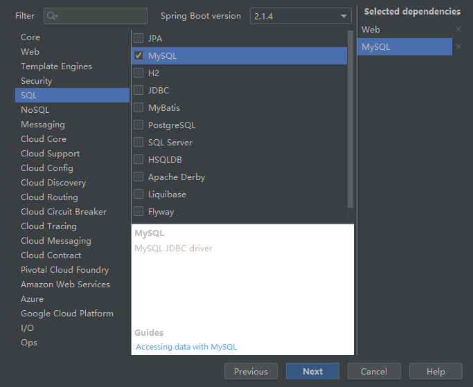

# oms

#### 介绍
Order management system
build with spring & mysql

#### 软件架构
软件架构说明


#### 环境配置
1. IDEAC 2019.1 中添加Spring Assistant
    gradle 修改为国内镜像：

  ```java
  C:\Users\<windows用户名称>\.gradle 中新建文件init.gradle
  文件内容如下:
  
  allprojects{
      repositories {
          def ALIYUN_REPOSITORY_URL = 'http://maven.aliyun.com/nexus/content/groups/public'
          def ALIYUN_JCENTER_URL = 'http://maven.aliyun.com/nexus/content/repositories/jcenter'
          all { ArtifactRepository repo ->
              if(repo instanceof MavenArtifactRepository){
                  def url = repo.url.toString()
                  if (url.startsWith('https://repo1.maven.org/maven2')) {
                      project.logger.lifecycle "Repository ${repo.url} replaced by $ALIYUN_REPOSITORY_URL."
                      remove repo
                  }
                  if (url.startsWith('https://jcenter.bintray.com/')) {
                      project.logger.lifecycle "Repository ${repo.url} replaced by $ALIYUN_JCENTER_URL."
                      remove repo
                  }
              }
          }
          maven {
              url ALIYUN_REPOSITORY_URL
              url ALIYUN_JCENTER_URL
          }
      }
  }
  ```


2. IDE 中新建工程

   

3. 添加依赖

   

4. 设置gradle自动导入包

   

5. 等待配置包完成后，主文件自动变为可执行

   

6. 启动服务

   

7. 浏览器中打开 http://localhost:8080

   

#### 安装教程

1. xxxx
2. xxxx

#### 使用说明

1. xxx
2. xxx
3. xxx

#### 参与贡献

1. 联系管理员邀请你加入仓库

2. 添加公钥到码云：

   http://www.runoob.com/w3cnote/view-ssh-public-key.html

3. ```bash
   # Setting Up User Name and Email Address
   $ git config --global user.name "John Doe"
   $ git config --global user.email johndoe@example.com
   # Checking Your Settings
   $ git config --list
   ```


4. 使用ssh方式，克隆远程分支到本地，git clone git@gitee.com:njcky/oms.git （只会clone 远程的master分支）

5. 新建 自己的 分支

   1. 查看远程分支 git branch -a （origin为远程仓库的别名）
   2. 查看本地分支 git branch
   3. 切换到远程分支origin/mr并命令本地分支为"mr": git checkout -b mr origin/mr

6. 提交代码 git push (默认提交到本地分支对应的远程分支)

   1. git push 避免每次都输入密码？

      是否使用了https的方式进行连接？

      $ git remote -v
      origin  https://gitee.com/njcky/oms.git (fetch)
      origin  https://gitee.com/njcky/oms.git (push)

      说明使用了ssh的方式进行了连接，切换回master分支:git checkout master, 

      修改为ssh方式连接：

      git remote rm origin

      git remote add origin XXX.git (这里一般是你项目中的ssh地址)

      git push -u origin master

7. 新建 Pull Request


#### 码云特技

1. 使用 Readme\_XXX.md 来支持不同的语言，例如 Readme\_en.md, Readme\_zh.md
2. 码云官方博客 [blog.gitee.com](https://blog.gitee.com)
3. 你可以 [https://gitee.com/explore](https://gitee.com/explore) 这个地址来了解码云上的优秀开源项目
4. [GVP](https://gitee.com/gvp) 全称是码云最有价值开源项目，是码云综合评定出的优秀开源项目
5. 码云官方提供的使用手册 [https://gitee.com/help](https://gitee.com/help)
6. 码云封面人物是一档用来展示码云会员风采的栏目 [https://gitee.com/gitee-stars/](https://gitee.com/gitee-stars/)